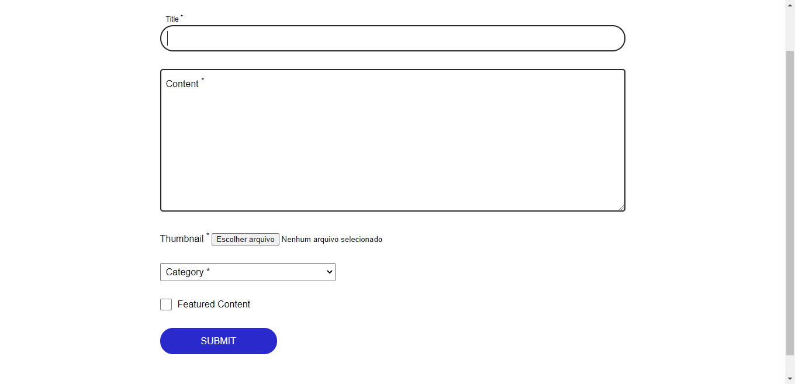

<p align="center">
  <a href="#-projeto">Projeto</a>&nbsp;&nbsp;&nbsp;|&nbsp;&nbsp;&nbsp;
  <a href="#-layout">Layout</a>&nbsp;&nbsp;&nbsp;|&nbsp;&nbsp;&nbsp;
  <a href="#-como-utilizar">Como utilizar</a>&nbsp;&nbsp;&nbsp;|&nbsp;&nbsp;&nbsp;
  <a href="#-tecnologias">Tecnologias</a>&nbsp;&nbsp;&nbsp;|&nbsp;&nbsp;&nbsp;
  <a href="#-license">Licença</a>
</p>

## 🚀 Projeto

Desafio proposto pela empresa Plathanus, onde consistia desenvolver um App de noticias com front-end react-native e o back-end com nodejs.

## 🎨 Layout




## 💻 Como utilizar

### Faça o clone do repositório
```bash
# Digite o comando abaixo para clonar o repositório
$ git clone https://github.com/fabricioig863/desafio-plathanus
```

### Iniciando o Projeto

```bash
# Vá para o repositório do projeto
$ cd backend

# Instale as dependencias
$ yarn

# Para iniciar o servidor
$ yarn start

# Ao ver o servidor rodando acessa a página localhost:3333, essa página será a página onde voce cadastrará as noticias.

```

```bash
# Vá para o repositório do projeto
$ cd NewsAppMobile

# Instale as dependencias
$ yarn

# Para iniciar o App
$ npm start

# Lembrando que para acessar o app voce precisa atender aos requisitos necessários caso esteja com dúvidas consulte o site abaixo:
```
- [guia de instalação](https://sujeitoprogramador.com/ambiente-windows/)

## 💻 Tecnologia

- HTML
- CSS
- React-Native
- NodeJs


## 📝 License

Este projeto está sob a licença MIT. Consulte o [LICENSE](LICENSE.md) para obter detalhes.

Feito com ❣️ por Fabricio Ignacio de Espindola
